# AI Literature Review Workflow Diagrams

## Overview

This document provides visual representations and detailed explanations of the Evidence Assistant's 5-step systematic literature review workflow.

## Core 5-Step Workflow

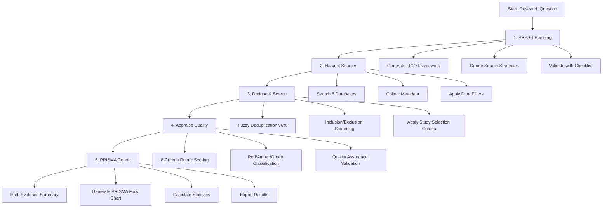

## LICO Framework Detail

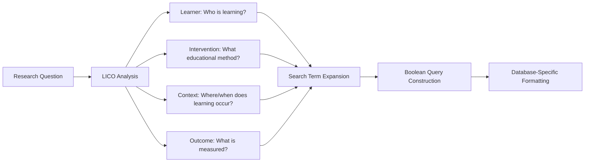

## Database Harvesting Process

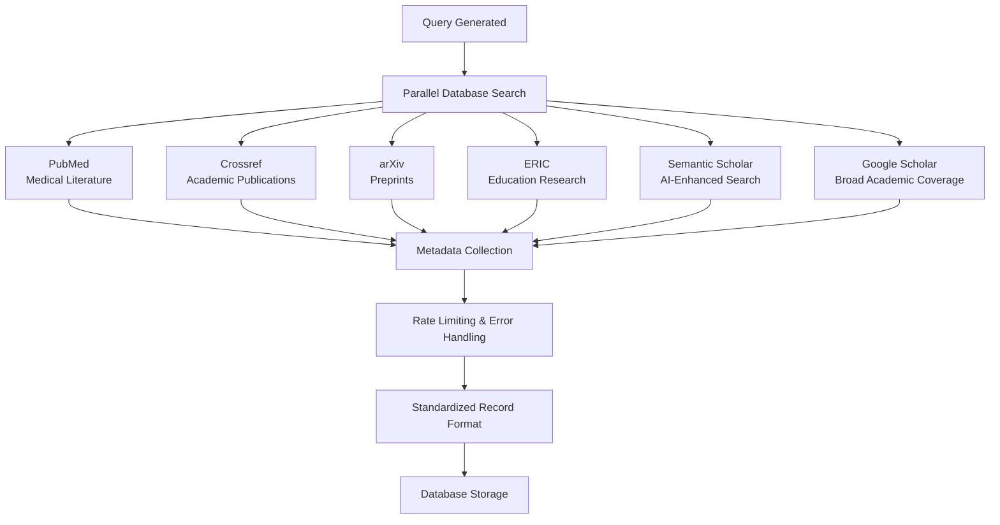

## Deduplication & Screening Workflow

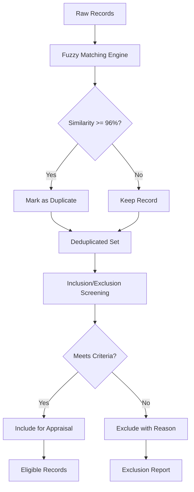

## Quality Appraisal Rubric

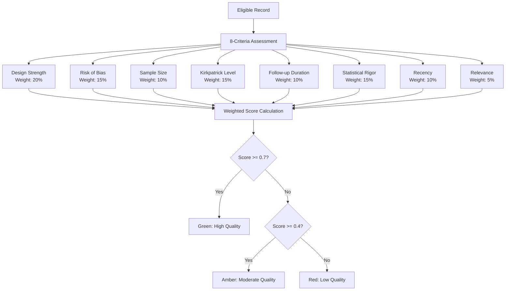

## PRISMA Flow Generation

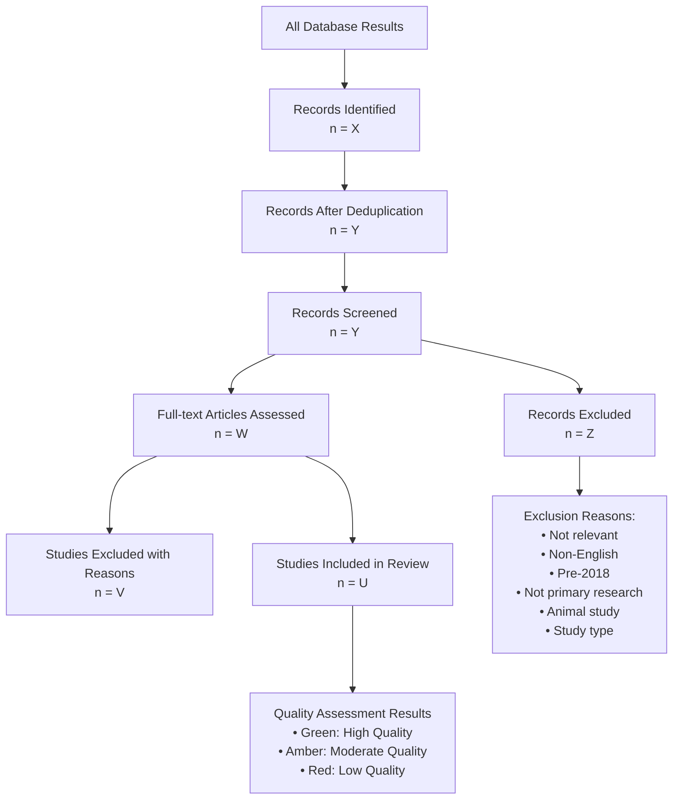

## API Integration Points

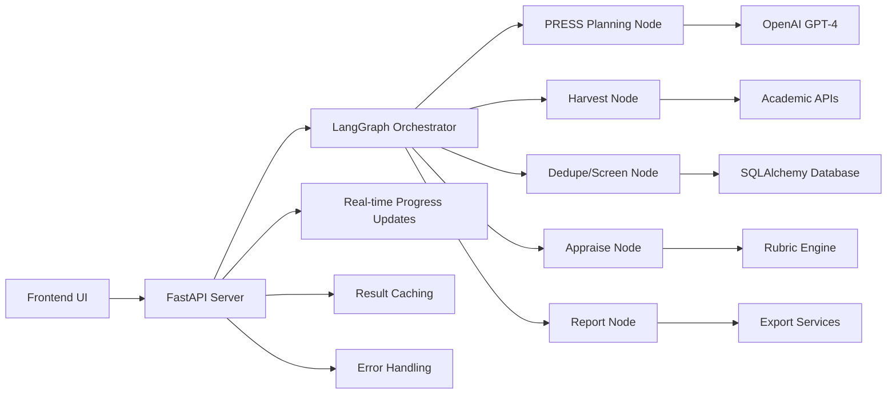

## Error Handling & Recovery

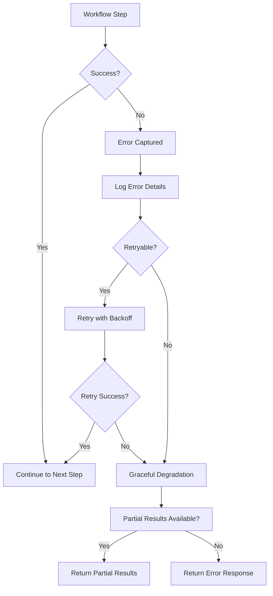

## Performance Monitoring

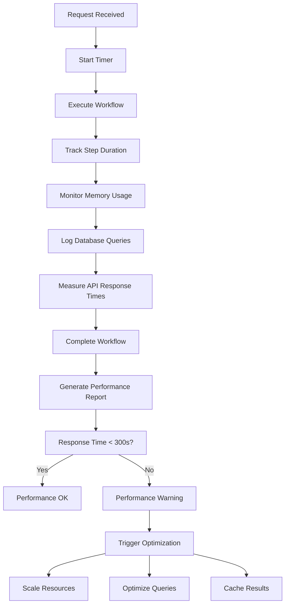

## Data Flow Architecture

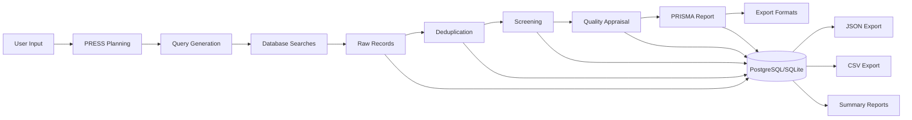

## Integration Testing Flow

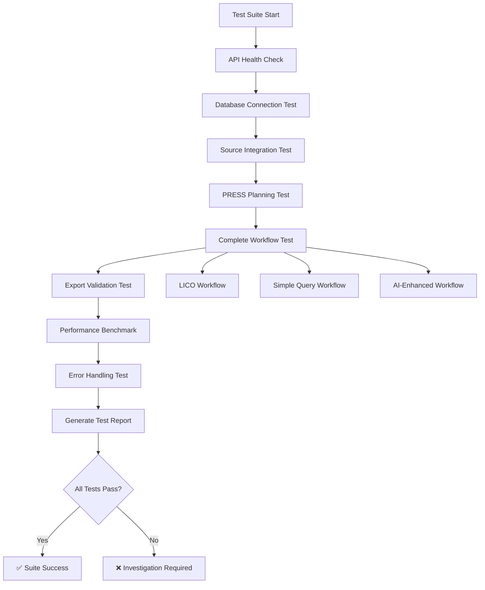